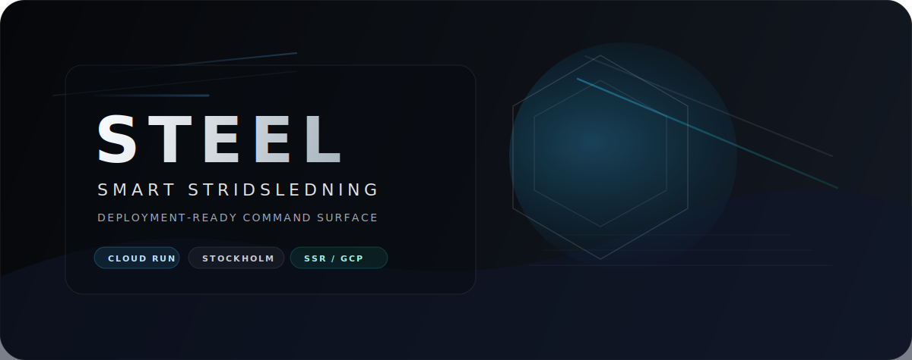

<div align="center">
  
</div>

# Steel - Smart Stridsledning

Steel - Smart Stridsledning is the canonical live copy of the command-support application. It packages the Angular SSR app, backend server, Docker build, and Cloud Run deployment path into one repo that can be pushed, deployed, and operated without the research artifacts.

## Snapshot

- Angular 21 SSR application with Express server rendering
- Cloud Run target region: `europe-north2` for Stockholm hosting
- Single-instance runtime model for in-memory simulation and websocket state
- Local branding assets in `public/`
- Runpod-backed lab inference with local fallback when the endpoint is offline
- OpenRouter-backed rationale generation through the backend
- Public capability remapping, C2 resilience, counterfactual, and reference documentation surfaces
- Fresh GitHub-ready repo, not a research archive

## What Ships

- Mission overview, tactical control, commander orchestration, readiness, governance, and robustness surfaces
- C2 resilience lab, counterfactual lab, and reference docs surfaces
- SSR server entry points and backend rationale endpoints
- Dockerfile for repeatable container builds
- GCP deploy script for Artifact Registry and Cloud Run
- Minimal favicon and banner asset for the repository landing page

## What Is Deliberately Excluded

- Research notes, plans, and supporting documents
- `.env` and any other local secrets
- Historical scaffolding that is not needed to deploy the app

## Operating Model

The service is designed as a single Cloud Run instance with request concurrency above one:

- `min-instances=0`
- `max-instances=1`
- `concurrency=20`
- `cpu-throttling` enabled

That is intentional. The app keeps state in memory and uses websockets, so horizontal scaling would create drift between replicas. The higher concurrency avoids route-load failures when multiple browser assets arrive at once.

## Architecture

1. The browser loads the Angular SSR app.
2. The server renders the route and exposes the API surface.
3. Optional rationale requests go through the backend, which can forward to OpenRouter if configured.
4. The robustness lab can offload to Runpod when the remote endpoint is configured.
5. The counterfactual lab and public capability layer stay local and deterministic in the app shell.

Deployment is intentionally narrow:

- [`Dockerfile`](./Dockerfile) builds the container image.
- [`deploy/gcp/deploy.sh`](./deploy/gcp/deploy.sh) builds and deploys to Cloud Run.
- [`src/server.ts`](./src/server.ts) hosts SSR plus API routes.

## Deploy

### Prerequisites

- `gcloud` authenticated and pointed at the target project
- Billing enabled on the GCP project
- Cloud Run and Artifact Registry access

### Cloud Run

```bash
chmod +x deploy/gcp/deploy.sh
PROJECT_ID=your-project-id deploy/gcp/deploy.sh
```

If `PROJECT_ID` is already set in your local `gcloud` config, you can omit it.

Secrets should be injected through Cloud Run secret bindings or a local `.env` file. Do not bake `OPENROUTER_API_KEY` or `RUNPOD_API_KEY` into the image.

## Local Development

```bash
npm install
npm run dev
```

The app starts on [http://localhost:3000](http://localhost:3000).
For API-backed features, run the server-side env vars as well if you want OpenRouter or Runpod behavior locally.

## Useful Scripts

```bash
npm run build        # production build
npm run test         # unit tests
npm run lint         # static analysis
npm run serve:ssr:app  # run the built SSR server
```

## Repository Layout

```text
src/
  app/
    core/        services and state
    features/    route-level surfaces
    shared/      UI primitives and domain data
  server.ts      SSR server and API routes
deploy/gcp/      Cloud Run deployment scaffold
public/          branding assets and favicon
```

## Runtime Notes

- Cloud Run supports websockets, so the theater view remains interactive.
- `OPENROUTER_API_KEY` enables live rationale generation through the backend.
- `OPENROUTER_MODEL` selects the OpenRouter chat model used for rationale text.
- `RUNPOD_API_KEY` and `RUNPOD_ENDPOINT_ID` enable remote lab inference on Runpod.
- `/api/lab/run` automatically falls back to Steel's deterministic local lab if Runpod is unavailable.
- `APP_LOCK_PASSWORD` overrides the built-in lock password if you need to set it at deploy time.
- `APP_LOCK_TOKEN_TTL_SECONDS` controls the lifetime of the lock cookie.
- The repo is meant to stay as the deployable source of truth for the fresh GitHub repository.

## Cost Profile

- Default deployment is request-based Cloud Run billing with `min-instances=0`, `max-instances=1`, and `concurrency=20`.
- That keeps idle cost near zero and avoids the route-load 429s caused by `concurrency=1`.
- If you want lower cold-start latency, set `MIN_INSTANCES=1` at deploy time and accept the extra idle cost.
